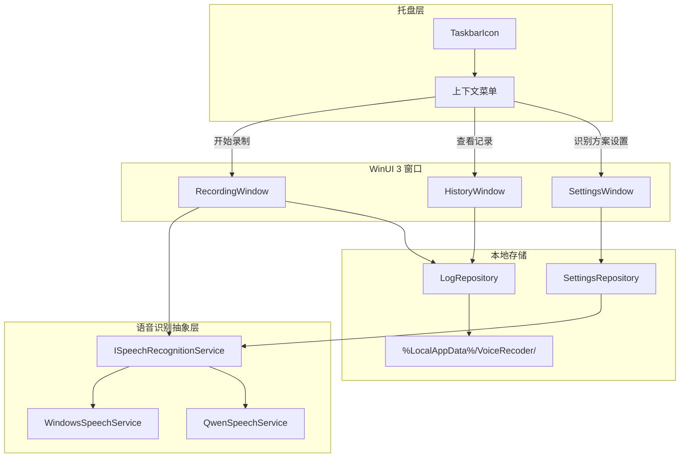

# 语音日志单机软件实现计划

## 技术选型

| 层面 | 选择 | 理由 |
|------|------|------|
| 运行时 | .NET 10 | 用户明确要求 |
| UI 框架 | **WinUI 3**（Windows App SDK） | Windows 11 官方最新桌面 UI 框架 |
| 托盘 | **H.NotifyIcon.WinUI** | 支持 .NET 10，提供上下文菜单与无窗口模式 |
| 主识别 | **Windows.Media.SpeechRecognition** | WinRT 原生 API，支持 `zh-CN` 连续听写，WinUI 3 项目可直接引用 |
| 备选识别 | **Qwen DashScope API** | `qwen3-asr-flash-realtime`（WebSocket 实时）+ `qwen3-asr-flash`（短音频同步） |
| 音频采集（Qwen 路径） | **NAudio** | 麦克风采集为 PCM/WAV，供云端识别 |
| 本地存储 | JSON 文件按日期分片 | 轻量、无需数据库，便于按日查看 |

项目当前为空仓库（仅 [`README.md`](README.md)），需从零搭建。

## 整体架构



## 项目结构

```
VoiceRecoder/
├── VoiceRecoder.sln
├── src/
│   └── VoiceRecoder/
│       ├── VoiceRecoder.csproj          # net10.0-windows10.0.19041.0
│       ├── App.xaml / App.xaml.cs       # 应用入口，初始化托盘
│       ├── Services/
│       │   ├── ISpeechRecognitionService.cs
│       │   ├── WindowsSpeechService.cs  # WinRT 连续听写
│       │   ├── QwenSpeechService.cs     # WebSocket 实时 + HTTP 同步
│       │   ├── AudioCaptureService.cs   # NAudio 麦克风采集
│       │   ├── LogRepository.cs         # 按日期读写日志
│       │   └── SettingsRepository.cs    # 识别方案、API Key 等
│       ├── Models/
│       │   ├── VoiceLogEntry.cs         # { Id, Timestamp, Text }
│       │   ├── DailyLog.cs              # { Date, Entries[] }
│       │   └── AppSettings.cs           # { Provider, ApiKey, Language }
│       ├── Views/
│       │   ├── RecordingWindow.xaml     # 录制界面
│       │   ├── HistoryWindow.xaml       # 按日期浏览
│       │   └── SettingsFlyout.xaml        # 识别方案切换（或独立窗口）
│       └── Assets/
│           └── TrayIcon.ico
```

## 环境准备

开发机需安装（实现阶段执行）：

```powershell
winget install Microsoft.DotNet.SDK.10
winget install Microsoft.WinAppCLI
dotnet new install Microsoft.WindowsAppSDK.WinUI.CSharp.Templates
```

启用 Windows **开发者模式**（WinUI 打包应用需要）。

## 核心功能设计

### 1. 托盘常驻

- 使用 `H.NotifyIcon.WinUI` 的 **Windowless** 模式：启动后无可见主窗口，仅显示右下角托盘图标
- 托盘右键菜单结构：

```
开始录制
查看记录
─────────
识别方案  ▸  Windows 内置 / Qwen API
设置...      （API Key、语言 zh-CN 等）
─────────
退出
```

- 识别方案切换立即写入 `settings.json`，下次录制生效
- 处理 `WM_TASKBARCREATED` 消息（H.NotifyIcon 已内置），防止 Explorer 重启后图标消失

### 2. 录制窗口（RecordingWindow）

- 从托盘菜单打开，显示：
  - 实时转写文本区（`TextBox` 只读或可编辑，便于用户修正）
  - 状态指示：录音中 / 识别中 / 错误
  - 「开始/停止」按钮
- 流程：
  1. 点击开始 → 根据当前 `AppSettings.Provider` 选择服务
  2. 实时追加识别文本到 UI
  3. 点击停止 → 将本次内容作为一条 `VoiceLogEntry` 追加到当日文件
  4. 窗口可关闭，应用继续在托盘运行

### 3. Windows 内置识别（主 SDK 路径）

使用 `Windows.Media.SpeechRecognition.SpeechRecognizer`：

```csharp
var lang = new Language("zh-CN");
var recognizer = new SpeechRecognizer(lang);
recognizer.UIOptions.AudiblePrompt = false;
recognizer.UIOptions.IsReadBackEnabled = false;

var dictationConstraint = new SpeechRecognitionTopicConstraint(
    SpeechRecognitionScenario.Dictation, "dictation");
recognizer.Constraints.Add(dictationConstraint);
await recognizer.CompileConstraintsAsync();

recognizer.ContinuousRecognitionSession.ResultGenerated += OnResult;
await recognizer.ContinuousRecognitionSession.StartAsync();
```

要点：
- 需系统已安装 **中文语音包**（设置 → 时间和语言 → 语音）
- 需开启隐私选项「在线语音识别」（设置 → 隐私 → 语音）
- `ResultGenerated` 在后台线程触发，通过 `DispatcherQueue` 更新 UI
- 封装为 `WindowsSpeechService : ISpeechRecognitionService`

### 4. Qwen API 识别（备选路径）

封装为 `QwenSpeechService : ISpeechRecognitionService`：

- **实时录制**：连接 DashScope WebSocket
  - 端点：`wss://dashscope.aliyuncs.com/api-ws/v1/realtime`
  - 模型：`qwen3-asr-flash-realtime`
  - `AudioCaptureService`（NAudio）以 16kHz PCM 单声道推送音频块
  - 监听 `conversation.item.input_audio_transcription.text` 事件流式更新 UI
- **网络中断/短句兜底**：停止后若仍有未识别片段，用 `qwen3-asr-flash` HTTP 同步接口（DashScope 协议支持本地文件路径）做最终转写
- API Key 存储在 `%LocalAppData%/VoiceRecoder/settings.json`，设置界面输入，**不明文提交到 git**

用户可在托盘「识别方案」子菜单中切换，无需重启应用。

### 5. 按日期查看记录（HistoryWindow）

- 左侧：`CalendarDatePicker` 或日期列表（有记录的日期高亮）
- 右侧：选中日期下所有 `VoiceLogEntry`，按时间倒序显示
- 数据来源：`%LocalAppData%/VoiceRecoder/logs/2026-07-06.json`

日志文件格式示例：

```json
{
  "date": "2026-07-06",
  "entries": [
    { "id": "guid", "timestamp": "2026-07-06T14:30:00", "text": "今天完成了项目计划..." }
  ]
}
```

### 6. 抽象接口（便于双方案切换）

```csharp
public interface ISpeechRecognitionService
{
    SpeechProvider Provider { get; }
    event EventHandler<string> PartialResult;
    event EventHandler<string> FinalResult;
    event EventHandler<string> Error;
    Task StartAsync(CancellationToken ct);
    Task StopAsync();
    bool IsAvailable();  // Windows: 检查语音包; Qwen: 检查 API Key
}
```

`SpeechServiceFactory` 根据 `AppSettings.Provider` 返回对应实现。

## 关键 NuGet 依赖

```xml
<PackageReference Include="Microsoft.WindowsAppSDK" Version="1.8.*" />
<PackageReference Include="H.NotifyIcon.WinUI" Version="2.4.*" />
<PackageReference Include="NAudio" Version="2.2.*" />
<PackageReference Include="System.Text.Json" Version="9.*" />
```

WinUI 3 项目已内置 WinRT，无需额外引入 `Microsoft.Windows.SDK.Contracts` 即可使用 `Windows.Media.SpeechRecognition`。

## 权限与清单

在 `Package.appxmanifest` 中声明：

- `microphone` — 麦克风访问
- `internetClient` — Qwen API 网络请求

首次录制时通过 `MediaCapture` 或系统权限弹窗请求麦克风授权。

## 实现顺序

1. **脚手架**：`dotnet new winui -n VoiceRecoder`，配置 .NET 10、托盘无窗口启动
2. **存储层**：`LogRepository` + `SettingsRepository` + 数据模型
3. **Windows 识别**：`WindowsSpeechService` + 录制窗口联调
4. **Qwen 识别**：`AudioCaptureService` + `QwenSpeechService`（WebSocket）
5. **托盘菜单**：录制 / 查看 / 方案切换 / 设置 / 退出
6. **历史窗口**：日期选择 + 日志列表
7. **收尾**：图标资源、错误提示、麦克风/网络权限处理

## 风险与应对

| 风险 | 应对 |
|------|------|
| Windows 中文语音包未安装 | 启动录制前 `IsAvailable()` 检测，提示用户安装或切换到 Qwen |
| Windows 连续听写需联网 | 设置界面说明；离线场景引导使用 Qwen 或安装离线语音包 |
| Qwen API 产生费用 | 设置页标注；默认方案为 Windows 内置 |
| WinUI 3 托盘子菜单 | H.NotifyIcon 支持 `ContextMenu`，识别方案用 `RadioMenuFlyoutItem` 实现互斥选择 |

## 验证方式

- 托盘图标正常显示，Explorer 重启后图标恢复
- Windows 方案：中文连续说话，文本实时出现，停止后写入当日日志
- Qwen 方案：配置 API Key 后切换，录制转写正常
- 历史窗口：按日期正确加载、显示多条记录
- 方案切换：托盘菜单切换后，下次录制使用新方案
